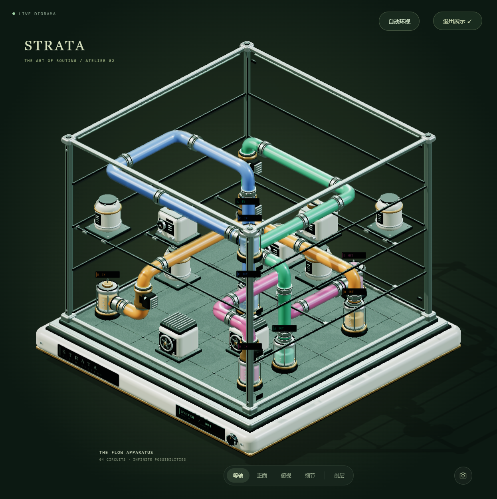
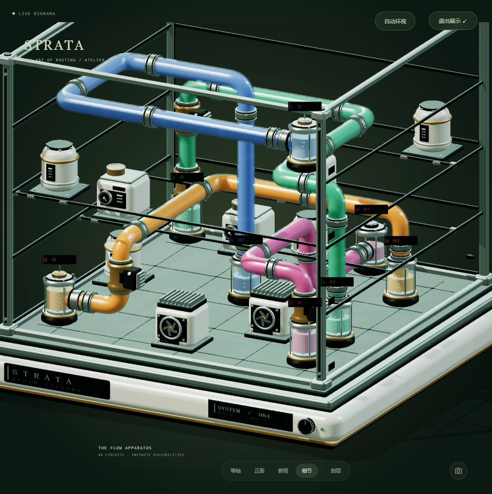
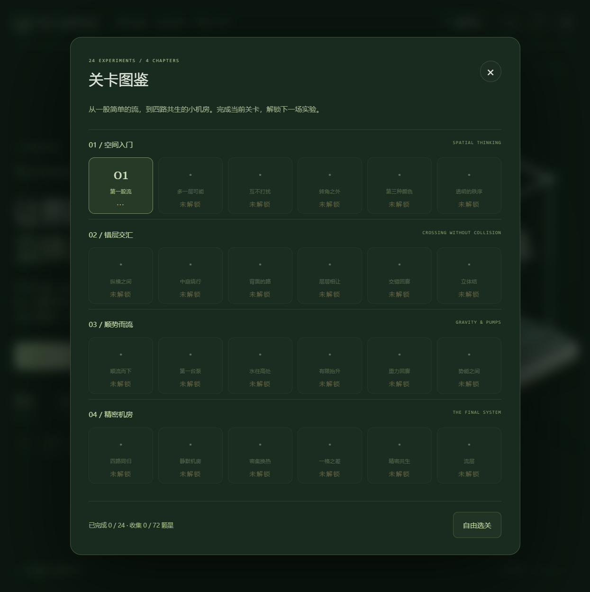
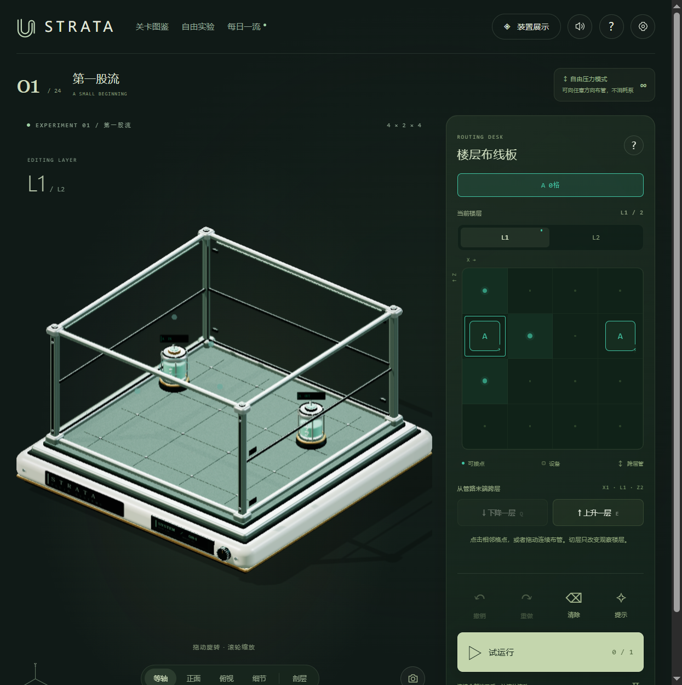

# 流层 STRATA · ATELIER 02

**在透明机柜中，给每一股液体找到一条立体路径。**


[在线体验 Demo](https://strata-flow-navy.vercel.app/)

## 作品截图

<table>
  <tr>
    <td width="50%"><br><sub>装置展陈：四路管线与完整透明机柜</sub></td>
    <td width="50%"><br><sub>细节视角：弯管、接头、设备与端口标识</sub></td>
  </tr>
  <tr>
    <td width="50%"><br><sub>关卡图鉴：四章、24 个递进实验</sub></td>
    <td width="50%"><br><sub>玩法界面：三维机柜与楼层布线板协同操作</sub></td>
  </tr>
</table>

> **版本**：2.0.0 · 完整自包含 3D 益智工程与双渲染管线作品  
> **交付物**：自包含离线单 HTML、预构建静态站点、自研 C/WASM CPU 软光栅引擎、93 项 Node 自动化测试、54 项 Playwright 浏览器自动化回归。

---

## 核心工程亮点与技术架构

本项目展示了一套具备极端设备容错能力的专业级 Web 3D 交付工程体系：

- **双渲染管线与极端环境降级（WebGL + 自研 C/WASM）**：
  - **GPU 分支**：基于 Three.js r140 实现程序化摄影棚环境、PMREM、金属/清漆/透射材质、连续管壁车削与实时阴影。
  - **WASM CPU 软光栅分支**：在无 WebGL 上下文的受限环境中，自动无缝降级至**自研 C 语言光栅化内核**（`render/raster.c`，编译为 wasm32）。由 JS 投影场景，C/WASM 执行三角形光栅化、插值法线着色、Z-Buffer 深度测试、透明度混合与 1024² 阴影贴图。
  - **JS/Canvas 2D 终极兜底**：在 WASM 不可用时自动退回 2D 交互线图，确保业务 100% 可用。
- **离散立体拓扑求解与可解性证明**：
  - 核心逻辑 (`engine.js`) 与 DOM / 渲染层严格隔离，专为三维机柜格点离散路径设计。
  - 内置程序化关卡生成器，先推演合法参考路径再布设工业设备障碍；经 200 组参数自动化回路回放，数学级保证生成关卡均有可行解。
- **严密的工程防线与自动化验收**：
  - 交付集成 93 项 Node 自动测试用例与 54 项 Playwright 浏览器真机模拟检查，杜绝界面破损与逻辑死锁。

---

## 快速上手与体验

### 1. 零依赖离线体验（推荐）
直接使用 Chrome 或 Edge 浏览器双击打开根目录的 `STRATA-Offline.html`。它将 Three.js 引擎、WASM 运行时、游戏模块、样式与第三方许可统一内聚在单个文件中，**不访问任何外网 CDN，不下载任何模型或字体文件**。

### 2. 本地静态服务（已内置成品，无须 npm install）
需要 Node.js 20+ 环境：
```bash
cd strata-flow
npm start
# 浏览器访问 http://127.0.0.1:4173
```
*Windows 用户亦可直接双击运行 `START-Windows.bat`。*

### 3. 生产环境部署
将 `dist/` 目录中的全部文件部署到任意 Nginx / 静态托管平台即可。纯静态架构，无服务端运行时、无数据库或鉴权密钥依赖。

---

## 玩法机制与操作

选择 A、B、C、D 中的一种液体，从入口沿上下左右前后六向网格连接至同字母出口。不同液体回路不可共享格点，需利用立体高差错层穿插绕过设备障碍。

在重力关卡中，向上爬升需消耗泵额度，平移与下降不消耗。

| 输入按键 | 对应操作 |
| :--- | :--- |
| **方向键** | 沿 X / Z 轴水平方向铺设管路 |
| **Q / E** | 从当前末端 下降 / 上升 一格（高度切换） |
| **1 – 4** | 快速切换 A / B / C / D 液体回路 |
| **Z / Y (Shift+Z)** | 撤销（Undo） / 重做（Redo） |
| **H** | 提示（Hint）当前回路可行下一步 |
| **Space (空格)** | 触发试运行（注液流动动画） |
| **Esc / R** | 暂停菜单 / 确认重新开始 |

*支持鼠标拖拽旋转机柜、滚轮缩放；移动端全手势旋转与双指捏合缩放。*

---

## 渲染管线与设备边界深度解剖

- **GPU 分支视觉规格**：实现解析倒角法线、连续管壁平滑、端口法兰接头、微型工业仪表贴图与克制的高光抗锯齿后处理，无冗余后处理堆叠。
- **WASM CPU 软光栅技术实现**：
  - 非预录图片或视频，而是**真实代码级 3D 三角形逐像素光栅化**；
  - 动态像素预算：旋转移动时自适应降低采样率以维持响应速度，静止后立即重新绘制 1.4 倍超采样高精静止帧；
  - 包含流体注入过程的几何面动态剪裁与实时阴影映射计算。

---

## 工程能力迁移与应用场景

本项目展示的双渲染架构与离散空间算法可直接类比并迁移至以下工业级场景：
- **工业机柜 / 数据中心管网排布**：将“机柜三维离散格点与多回路错层布管”迁移至服务器水冷回路、强弱电配电柜走线、工厂管廊的空间无冲突规划与连通性自检。
- **极端物理隔离环境的 3D 渲染方案**：将“WebGL + 自研 C/WASM CPU 软光栅双渲染管线”迁移至涉密物理隔离内网、低算力工控屏或禁用 GPU 加速的严苛硬件终端，提供 100% 确定可用的纯前端 3D 可视化兜底。
- **动力管网与流向仿真推演**：将“无 DOM 依赖的拓扑求解内核与生成器”迁移至供水/供暖阀门开闭状态推演、流体流向分析与管网泄漏阻断仿真看板。

---

## 本地开发与自动化测试

### 开发与构建指令
```bash
npm run dev       # 源码本地开发服务
npm run check     # 全量 JS/MJS 语法与规范检查
npm run build     # 重建 dist 生产包与单文件 Offline 版
npm test          # 93 项 Node 自动测试（含 200 组生成关卡自动验证）
npm run verify    # 语法检查 → 构建 → 自动化测试流水线
```

### WASM 软光栅器构建
C/WASM 内核已预编译附带。若修改 `render/raster.c` 底层光栅算法，可使用带 wasm32 目标的 clang 重新编译：
```bash
npm run build:renderer
npm run build
```

### Playwright 自动化浏览器回归
```bash
python tests/browser_qa.py --suite core --inline
python tests/browser_qa.py --suite features --inline
python tests/browser_qa.py --suite layout --inline
python tests/studio_qa.py
npm run acceptance
```

---

## 模块结构与版权

- `engine.js`：无 DOM 依赖的立体布线逻辑与重力求解核心；
- `levels.js`：关卡拓扑、固定种子与程序化关卡生成；
- `scene.js`：Three.js GPU 场景编排与材质管理；
- `software.js`：WASM CPU 软光栅渲染器桥接；
- `main.js`：UI 状态绑定与渲染主循环调度。

模型、图标与声音均为纯代码生成，无外置字体依赖。项目代码保留全部权利；内嵌的 Three.js 遵循 MIT License（完整许可详见 `THIRD_PARTY_NOTICES.md`）。
